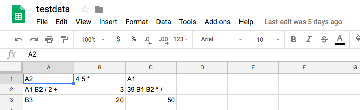
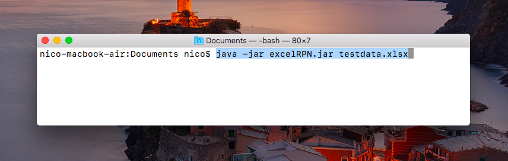

## Excel RPN Calculator
Java program that reads an excel file and processes the data in each cell
as an RPN calculator. The following is an example input file:

### excelRPNCode
contains the code used to build the program 
**src/excelRPNCalc/excelRPNCalc.java** - main program file 
**lib** - folder with program dependencies

### excelRPNCalc
contains the .jar program file 
**excelRPN.jar** - executable jar file 

you can run this code in terminal/command prompt to run the program (replace testdata.xlsx with your excel file name)
 
the program outputs the results into result.xlsx
